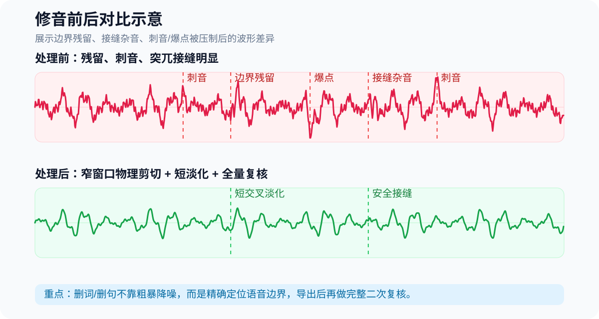
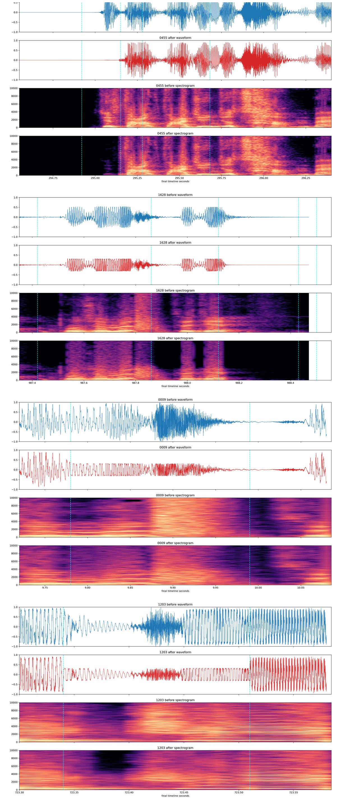

# Audio-sound

`Audio-sound` 是一个面向中文口播、课程讲解、旁白和访谈音频的 Windows 本地音频清理工作流仓库。

它的目标不是追求绝对安静，而是在自然度、清晰度和稳定性优先的前提下，让 Codex 或人工操作者得到可交付成品，并对已确认的噪声、呼吸、口水音、停顿残留和删词接缝做可复核处理。


## 效果展示

> 说明：仓库中不提交客户原始音视频或成品音视频。下面的图是公开安全的波形示意，用来说明本仓库重点解决的“边界残留 / 接缝杂音 / 刺音爆点”问题。真实项目的成品音视频建议放在飞书文档或 GitHub Releases 的 Assets 中。



真实处理证据示例：下图来自一次已完成修音任务的频谱/波形复核图，已裁掉文件说明，仅保留“处理前/处理后”的声学证据。



典型处理效果：
- 删除重复字、口误、废句后，避免残留半个音节。
- 对接缝使用短交叉淡化或安全停顿，减少“突然接上下一句”的卡顿感。
- 对刺耳瞬态、爆点、齿音进行窄窗口压制，尽量不伤正常人声。
- 导出后做完整二次复核，而不是只检查被修改的时间点。

## 适用范围

当前仓库主要适合：

- 中文课程讲解
- 中文口播 / 配音 / 旁白
- 中等噪声环境下的采访音轨
- 需要批量处理并保留报告的音频
- 需要删除口误、重复字、废句并修复接缝的视频/音频

## 仓库结构

- `.codex/skills/audio-sound/`：仓库级 Codex skill，记录默认处理规则和验收标准。
- `audio_sound/`：核心 Python 包，包含配置、流程、删词剪辑和 CLI 逻辑。
- `scripts/audio_cleanup.py`：底层清理、检查、安装和维护入口。
- `scripts/audio_skill_workflow.py`：推荐的最终成品处理入口。
- `scripts/evaluate_audio_pair.py`：同源前后对比与质量守门回归工具。
- `audio-verify-delivery`：将最终 WAV/MP3、核心报告、独立同源对比和 SHA-256 绑定为发布验证清单。
- `scripts/remove_spoken_segments.py`：物理删词、删句、视频同步剪辑入口。
- `presets/`：处理预设。
- `docs/`：架构、调参和参考说明。
- `tests/`：单元测试。
- `release/`：仅用于说明发布包位置；正式压缩包放在 GitHub Releases。

## 环境要求

必需：

- Python 3.10+
- `ffmpeg`
- `ffprobe`

推荐：

- `torch`
- `torchaudio`
- `librosa`
- `intervaltree`
- `deepfilternet`

可选外部资产：

- 本地 `Respiro-en` 仓库
- 本地 `respiro-en.pt` 权重

注意：`tools/`、`ffmpeg/`、`.env`、`output/`、`scratch/` 都是本地运行资产，不进入 Git 仓库。

## 快速开始

检查运行环境：

```bash
python scripts/audio_cleanup.py doctor
```

Windows 下初始化本地环境：

```bat
setup.cmd
```

列出可用预设：

```bash
python scripts/audio_cleanup.py list-presets
```

检查单个音频文件：

```bash
python scripts/audio_cleanup.py inspect "D:/audio/raw-voice.wav"
```

## 推荐成品流程

默认最终交付请使用：

```bash
python scripts/audio_skill_workflow.py run "D:/audio/raw-voice.wav"
```

默认模式是 `auto`。该流程会：

1. 提取源音频为 WAV，并保留源采样率与声道布局。
2. 检查运行环境和可用依赖。
3. 先建立 `natural` 基线：55 Hz 高通、1.25:1 轻压缩和整体响度统一。
4. 自动检查底噪、削波、动态范围和可用噪声窗口。
5. 根据缺陷证据和 `doctor` 能力尝试固定候选，包括安全的 Respiro 呼吸衰减和 DeepFilterNet 降噪；模型不可用时记录 `runtime_unavailable`。
6. 用格式、吞字、高频清晰度、短时增益、局部相关性、可量化收益和可选双 ASR 守门筛选候选；模型没有实际收益时回退基线。
7. 输出最终 WAV、MP3、报告、指标和频谱证据。
8. 将最终成品放入 `output/修音成品/`；守门失败时停止交付并保留报告。

当使用 `final` 处理明确的呼吸音或停顿杂音时，原始 `raw_wav` 不再被原地改写。工作流会融合 Respiro、辅助停顿边缘和噪声型频谱证据，只在语音起点前的授权窗口内按附近底噪自适应处理；母带后继续复检和窄窗口补处理。报告中 `breath_cleanup.status=PASS` 且 `final_residual_windows` 为空才允许交付。preservation 守门仅排除这些有证据的授权窗口，不会放宽其余语音区域。

`final` 也会对确认静音内部的过渡底噪做语音安全 AutoGate 等价清理：两侧保留安全边界（句间约 45 ms，片头/片尾约 25 ms），确认无声核心目标为 `silence_floor_dbfs=-96`，必要时执行多轮窄窗口衰减。该阶段不会启用全局 Dynamics Gate / `agate` 或无证据数字硬静音；`pause_cleanup.status=PASS`、`mode=speech_safe_autogate`、空残留列表和固定刻度局部频谱（中间接近黑色）共同构成交付证据。

只想跑自然基线时：

```bash
python scripts/audio_skill_workflow.py run "D:/audio/raw-voice.wav" --mode natural
```

同源前后对比：

```bash
python scripts/evaluate_audio_pair.py --source "D:/audio/raw.wav" --processed "D:/audio/processed.wav" --output "scratch/pair-report.json"
```

最终交付独立验证：

```powershell
verify_delivery.cmd --source "D:/audio/raw.wav" --final-wav "output/修音成品/修音版_raw.wav" --final-mp3 "output/修音成品/修音版_raw.mp3" --report "output/<run>/<job>/audio_preprocess/audio_process_report.json" --output "output/<run>/delivery-verification.json"
```

该命令不使用授权排除窗口。只有验证清单 `status=PASS` 且 `release_blocked=false`，实际交付文件才满足仓库的自动发布门槛。

最终命名规则：

```text
修音版_<原音频文件名>.wav
修音版_<原音频文件名>.mp3
```

如果同名文件已存在，则自动递增为 `_01`、`_02`。

## 删词与接缝修复

当目标是删除一句话、口误、重复字或指定时间段时，不要只做降噪，应使用物理删词脚本：

```bash
python scripts/remove_spoken_segments.py run "D:/video/第二段.mp4" --cut "0.62,1.82" --removed-phrase "啊说德语啊"
```

多个片段可以重复传入 `--cut`：

```bash
python scripts/remove_spoken_segments.py run "D:/video/第六段.mp4" --cut "0.00,1.80" --cut "2.10,2.34" --removed-phrase "删除口误"
```

默认删词规则：

- `--boundary-search-ms 80`：在边界附近寻找更低能量位置，避免保留残留音素。
- `--crossfade-ms 12`：短交叉淡化，只用于防爆点，不用于掩盖残留。
- 视频输入会同步补偿音频交叉淡化，避免多次删除后音画漂移。

如果删完后仍然像“突然接上下一句/一个字”，不要继续拉长交叉淡化，改用语音安全接缝：

```bash
python scripts/remove_spoken_segments.py run "D:/video/第二段.mp4" --cut "0.62,1.82" --removed-phrase "啊说德语啊" --seam-pause-ms 80
```

`--seam-pause-ms 60–100` 会让前句淡出、短暂停顿、下一句淡入，并在视频上冻结上一帧同等时长。

## 常用预设

- `natural`：自然基线；关闭自动呼吸衰减、模型降噪、自适应降噪、门限和自动静音。修音意图下只作失败回退，不算完成。
- `final`：完整修音链；也是 `auto` 主候选 `final_repair_best` 使用的预设。
- `clarity-leveling-safe`：`auto` 白名单清晰度/稳量候选；无低通、无门限、无硬静音、无模型降噪。
- `noise-cleanup-safe`：`auto` 白名单保守降噪候选；仅在同文件噪声窗口成立时启用。
- `respiro-breath-safe`：仅在 Respiro 运行时可用且输入存在呼吸候选证据时生成；只做最大 3 dB 的局部 duck，不做硬静音。
- `deepfilter-denoise-safe`：仅在稳定底噪、可用噪声窗和适用 SNR 同时成立时生成；关闭 post-filter。
- `model-combined-review`：仅在两个单模型候选分别通过后生成，并且必须有可绑定的双 ASR 证据才能交付。
- `fast`：快速一遍处理，动态处理较轻。
- `safe`：旧版自动清理预设，需要明确选择。
- `review`：清理后额外输出可疑静音/残留候选。
- `voice-isolate`：使用同文件噪声窗口做更有针对性的非人声残留压制。

`reference-legacy` 工作流仅保留用于复现旧版交付和问题对照，不再作为默认成品路径。

## 自适应安全策略

默认 `auto` 以 Best Repair 为目标：先测量源音频，强制竞争 `final_repair_best`，再按证据竞争模型安全候选，而不是对所有文件套同一组强度：

- `baseline`：没有高置信缺陷时，只走自然基线。
- `leveling_gentle`：语音动态范围偏宽时，只在受限范围内加强轻压缩。
- `noise_review`：检测到稳定底噪和候选噪声窗口时，只进入复核，不自动开启强降噪。
- `manual_review`：存在削波等高风险问题时，停止自动加强并要求人工复核。

Codex/GPT 可以读取诊断报告、选择固定白名单候选、输出 `capability_plan` / `repair_scorecard` 并解释原因，但不能直接生成任意 FFmpeg/DSP 参数。Respiro 和 DeepFilterNet 只作为固定安全候选按证据触发；模型候选必须真实执行、禁止 fallback 冒充、通过更严格伤害守门，并且取得可量化收益后才可能胜出。门限、硬静音、强降噪和整段呼吸切除仍禁止自动启用。

格式同样属于发布守门条件：实际处理和 WAV/MP3 交付默认保留源采样率与声道数；双声道只在诊断时临时下混为单声道分析，不会因此把成品转成单声道。声道、采样率、时长、削波、活跃语音衰减或短时增益波动异常时，`quality_guard` 会阻止交付。

示例：

```bash
python scripts/audio_cleanup.py clean "D:/audio/raw-voice.wav" --preset voice-isolate --noise-window 143.089208:144.093687
```

## 输出目录

默认输出分两类：

- `output/修音成品/`
  - 面向用户的最终 WAV/MP3/MP4。
  - 文件名遵守 `修音版_<原文件名>` 规则。
- `output/skill-<timestamp>_<source>/`
  - 流程报告、指标和频谱证据。
  - 中间音频默认清理，避免误交付。

排查时如需保留中间音频：

```bash
python scripts/audio_skill_workflow.py run "D:/audio/raw-voice.wav" --keep-intermediate-audio
```

## Codex 使用规则

本仓库包含项目 skill：

```text
.codex/skills/audio-sound/SKILL.md
```

在本仓库中，如果用户要求“处理音频”“修一下音频”“剪掉这句”“边界有残留”，Codex 应默认理解为最终可交付任务，而不是简单预览。

关键规则：

- 默认成品入口是 `python scripts/audio_skill_workflow.py run ...`，默认模式为 `auto`。
- 默认保留源采样率、声道数和立体声布局，分析下混不改变交付格式。
- 自适应控制层只能选择 `baseline`、`leveling_gentle`、`noise_review`、`manual_review` 四个安全档位。
- `auto` 只能在白名单候选中选择，不得直接生成任意 DSP 参数，也不得绕过质量守门启用破坏性处理。
- 删词、删句、重复字和接缝问题必须使用 `scripts/remove_spoken_segments.py`。
- 时间码只是候选，必须结合波形、频谱和局部听感确认边界。
- ASR 只能辅助定位，不能单独判定“重复字已解决”。
- 导出后必须二次完整复核，不只检查修改过的窗口。
- 旧错误成品不要作为新剪辑源，只能作为缺陷参考。

## 测试

运行测试：

```bash
pytest -q
```

或：

```bash
python -m unittest discover tests
```

运行 doctor：

```bash
python -m audio_sound.cli doctor
```

## 发布包

干净源码压缩包应放在 GitHub Releases 中，不提交到代码目录。

推荐生成方式：

```bash
git archive --format=zip --output tmp/Audio-sound-release-source.zip HEAD
```

该压缩包只包含 Git 已跟踪源码，不包含 `.env`、`tools/`、`ffmpeg/`、`output/`、`scratch/` 等本地资产。

## 当前不做的事情

- 图形界面剪辑器
- 完整 ASR 工作台
- 说话人分离
- 与 Adobe Audition 完全一致的处理链

这些能力可以后续扩展；当前仓库优先保证中文口播音频清理和删词接缝修复的稳定自动化。
